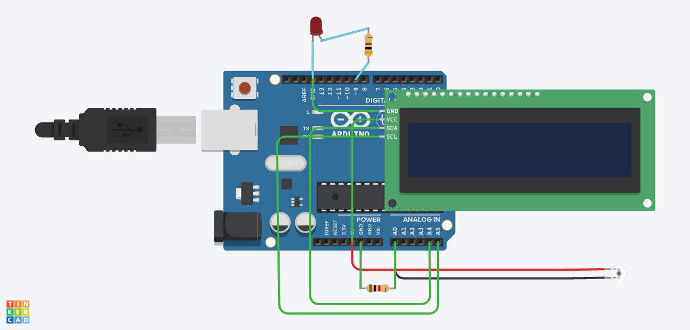

# Light Sensor Application (Tinkercad)

This project measures ambient light using a phototransistor and an Arduino Uno. A 16×2 I2C LCD displays the relative light level as a percentage.

A red LED acts as an automatic lamp. It is fully on in darkness, dim in medium light, and off in bright light. The project represents an automatic lighting system that can reduce unnecessary energy use.

🔗 **Tinkercad simulation:** [open the circuit](https://www.tinkercad.com/things/lxTXmmm2pqP-light-sensor-application)

---

## How it works

The ambient light sensor is a phototransistor. A phototransistor allows more current to flow when more light falls on it.

The phototransistor and the 1 kΩ resistor produce a light-dependent voltage at Arduino pin A0. The Arduino converts this voltage into a number using its analog-to-digital converter, or ADC.

The measured range in the simulation was 0 to 471. The program converts this range into a relative light percentage from 0% to 100%.

| Light percentage | Condition | LED output |
|---:|---|---|
| 0% to 24% | Dark | Fully on |
| 25% to 64% | Medium light | Dim |
| 65% to 100% | Bright | Off |

The LED is connected to PWM pin D9. PWM, or pulse-width modulation, switches the LED rapidly to control its apparent brightness.

### Measurement method

| Quantity | Method |
|---|---|
| Sensor reading | `analogRead(A0)` |
| Relative light level | Sensor reading mapped from 0–471 to 0–100% |
| Sensor voltage | Estimated from ADC count using a 5 V reference |
| LED brightness | PWM output on D9 |
| Light condition | Selected from the calculated light percentage |

---

## Design files

| File | Description |
|---|---|
| [Schematic (PDF)](Light.pdf) | Circuit schematic exported as a PDF |
| [PCB board file (.brd)](Light.brd) | Board design file for future hardware development |
| [`Light.ino`](Light.ino) | Arduino program for measurement, display, and LED control |

---

## Parts

| Part (Tinkercad name) | Qty | Settings |
|---|---:|---|
| Arduino Uno R3 | 1 | Default 5 V operation |
| Ambient Light Sensor [Phototransistor] | 1 | Collector connected to 5 V |
| Resistor | 1 | 1 kΩ sensor resistor |
| Red LED | 1 | Controlled from PWM pin D9 |
| Resistor | 1 | 300 Ω LED current-limiting resistor |
| MCP23008-based LCD 16×2 (I2C) | 1 | Address 0x20 |
| Jumper wires | As required | Used for power, signal, and I2C connections |

For real hardware, an Arduino Uno-compatible board and a visible-light phototransistor can be used. The LCD must use an MCP23008-compatible I2C interface at address 0x20, or the code must be adjusted for a different interface. The LED should have a suitable forward-current rating, typically up to 20 mA. Each LED must have its own current-limiting resistor.

---

## Wiring

### Ambient light sensor

| From | To |
|---|---|
| Arduino 5V | Phototransistor collector |
| Phototransistor emitter | Arduino A0 |
| Phototransistor emitter | One end of 1 kΩ resistor |
| Other end of 1 kΩ resistor | Arduino GND |

### LED

| From | To |
|---|---|
| Arduino D9 | One end of 300 Ω resistor |
| Other end of 300 Ω resistor | LED anode, the positive leg |
| LED cathode, the negative leg | Arduino GND |

### I2C LCD

| LCD pin | Arduino connection | Purpose |
|---|---|---|
| VCC | 5V | LCD power |
| GND | GND | Common ground |
| SDA | A4 | I2C data |
| SCL | A5 | I2C clock |

⚠️ Do not connect the LED directly to an Arduino output without the 300 Ω resistor.

⚠️ Do not connect the LED with reversed polarity. The anode goes toward D9 through the resistor, and the cathode goes to GND.

⚠️ Do not connect A0 directly to 5V or GND. A0 must connect to the junction between the phototransistor emitter and the 1 kΩ resistor.

⚠️ All components must share the Arduino GND connection.

---

## Test procedure

1. Open the circuit in Tinkercad and check every connection against the wiring tables.
2. Select the Arduino code editor and choose Text mode.
3. Paste the contents of `Light.ino` into the editor.
4. Start the simulation. The LCD should briefly show `LIGHT SENSOR` and `Starting...`.
5. Set the ambient light sensor to its minimum light level. The LCD should show approximately 0%, and the LED should be fully on.
6. Increase the simulated light to a medium level. The LCD percentage should rise, and the LED should become dim.
7. Set the sensor to its maximum tested light level. The sensor reading should approach 471, the LCD should approach 100%, and the LED should switch off.
8. Open the Serial Monitor. It should show the raw sensor reading, calculated percentage, detected condition, and PWM output.
9. Reduce the light again. The displayed percentage should decrease, and the LED should turn on again.

---

## Results and observations

- The lowest observed sensor reading was 0.
- The highest observed sensor reading was 471.
- The LCD successfully displayed the relative light percentage.
- The LED was fully on in darkness.
- The LED was dim in medium light.
- The LED was off in bright light.
- The relative light percentage was calculated using:

  $$
  \text{Light percentage} =
  \frac{\text{sensor reading}}{471}\times 100
  $$

- At the minimum reading:

  $$
  \frac{0}{471}\times100 = 0\%
  $$

- At the maximum reading:

  $$
  \frac{471}{471}\times100 = 100\%
  $$

- With the Arduino's assumed 5 V ADC reference, the voltage represented by a reading of 471 is:

  $$
  V_{A0} = \frac{471}{1023}\times5
  \approx 2.30\text{ V}
  $$

- The voltage represented by a reading of 0 is:

  $$
  V_{A0} = \frac{0}{1023}\times5 = 0\text{ V}
  $$

- Assuming approximately 2 V across the red LED, the estimated maximum LED current through the 300 Ω resistor is:

  $$
  I = \frac{5-2}{300}
  = 0.010\text{ A}
  = 10\text{ mA}
  $$

  This is a calculated estimate. The LED current was not directly measured.

---

## Known issues and limitations

- The displayed value is a relative percentage, not a calibrated measurement in lux.
- The maximum observed reading was 471 rather than the full Arduino ADC value of 1023.
- The calibration is based on the Tinkercad simulation and may differ with a real phototransistor.
- The thresholds between dark, medium, and bright are selected in software. They are not universal lighting standards.
- The calculated sensor voltage assumes a stable 5 V ADC reference.
- The estimated LED current was not verified with an ammeter.
- The physical circuit, schematic PDF, and PCB board file have not yet been verified.
- The circuit controls only one low-current LED. It cannot directly power a household lamp or a high-power LED.
- The program does not compensate for sensor noise near a mode threshold.

---

## Things I learned

- A phototransistor changes its current according to the amount of incident light.
- A resistor can convert the phototransistor current into a voltage that the Arduino can measure.
- The Arduino ADC converts an analog voltage into a numerical reading.
- Calibration can convert a limited sensor range into a useful relative percentage.
- PWM controls the apparent brightness of an LED without generating a true analog output voltage.
- An I2C display uses two communication lines, SDA and SCL, which reduces the number of Arduino pins required.
- A current-limiting resistor protects both the LED and the Arduino output pin.
- Real automatic lighting systems use calibrated sensors, filtering, hysteresis, and power-driver circuits.
- High-power lighting systems use a transistor, MOSFET, relay, or dedicated LED driver instead of powering a lamp directly from a microcontroller pin.

---

## Future improvements

- Calibrate the sensor against a real lux meter.
- Add hysteresis so the LED does not rapidly change modes near a threshold.
- Average several sensor readings to reduce noise.
- Add a push button for automatic and manual operating modes.
- Add a potentiometer for adjustable light thresholds.
- Replace the single LED with several model streetlights.
- Use a transistor or MOSFET to control a brighter external lamp.
- Add a motion sensor so full brightness is used only when movement is detected.
- Test the circuit with real components and record actual voltage and current measurements.
- Create and verify the schematic and PCB board files.

---

## License

MIT
